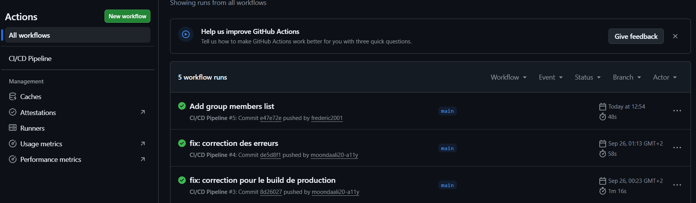
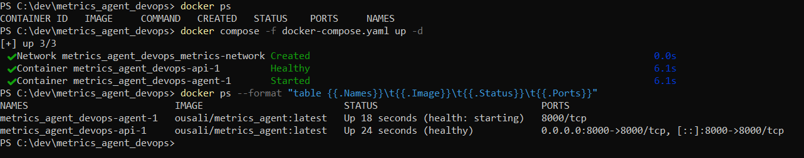
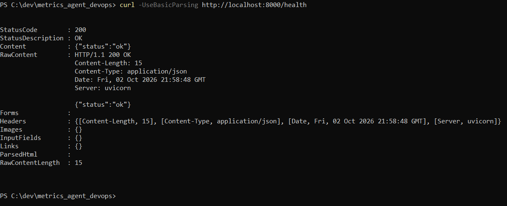
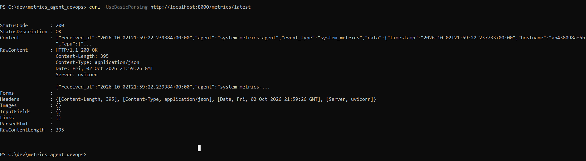

# System Metrics Agent — Conteneurisation, Orchestration & CI/CD

TP DevOps (Master — Éléments du DevOps) : conteneurisation, orchestration Docker Compose
et pipeline CI/CD GitHub Actions pour une application Python (FastAPI + psutil).


---

## 1. Architecture & présentation du projet

`system_metrics_agent` est un agent Python modulaire qui collecte des métriques système
(CPU, mémoire, charge système) et les transmet à une API de réception via HTTP.

Le projet est composé de **deux processus applicatifs distincts**, conteneurisés séparément :

| Service | Module | Rôle |
|---|---|---|
| **API** | `app.api` | API FastAPI exposant `/health`, `/metrics` (GET/POST), `/metrics/latest` — lancée avec `uvicorn` |
| **Agent** | `app.agent` | Collecte les métriques toutes les `COLLECTION_INTERVAL` secondes et les envoie vers `METRICS_ENDPOINT` |

```
system_metrics_agent/
├── app/
│   ├── __init__.py
│   ├── agent.py        # orchestration : collecte -> format -> envoi
│   ├── api.py           # API FastAPI de réception des métriques
│   ├── collector.py     # collecte CPU / RAM / charge (psutil)
│   ├── config.py        # configuration via variables d'environnement
│   ├── formatter.py     # mise en forme du payload JSON
│   └── sender.py        # envoi HTTP des métriques
├── tests/                # suite de tests automatisés (pytest)
├── screenshots/           # captures d'écran de preuve de fonctionnement
├── .github/workflows/
│   └── ci-cd.yml         # pipeline CI/CD GitHub Actions
├── .env.example          # modèle de configuration
├── .gitignore
├── .dockerignore
├── Dockerfile.dev         # image de développement (hot-reload)
├── Dockerfile              # image de production (multi-stage)
├── docker-compose.yaml     # orchestration production
├── docker-compose.override.yml  # bascule en mode développement
├── requirements.txt
├── requirements-dev.txt
└── README.md
```

**Communication entre services** : l'agent envoie ses métriques à l'API via le réseau
Docker interne `metrics-network`, en utilisant le nom du service (`http://api:8000/metrics`)
plutôt que `127.0.0.1` (qui ne fonctionne pas entre deux conteneurs distincts).

---

## 2. Prérequis système

- **Git** installé et configuré (`git --version`)
- **Docker Desktop** (ou Docker Engine + Docker Compose v2) — `docker --version` et `docker compose version`
- Un compte **GitHub** actif
- Un compte **Docker Hub** (gratuit) avec un **access token** (pas votre mot de passe)

---

## 3. Guide de lancement en développement

Le mode développement active le **hot-reload** : toute modification du code redémarre
automatiquement le serveur, grâce au montage du code local en volume.

```bash
# 1. Copier le modèle de configuration
cp .env.example .env

# 2. Lancer (docker-compose.override.yml est chargé automatiquement)
docker compose up --build

# 3. Dans un autre terminal, vérifier que ça fonctionne
curl http://localhost:8000/health
curl http://localhost:8000/metrics/latest

# 4. Arrêter
docker compose down
```

---

## 4. Guide de lancement en production

### A. Build local de l'image de production

```bash
# Ignorer explicitement l'override pour utiliser la config de prod pure
docker compose -f docker-compose.yaml up --build -d

docker ps                 # vérifier que les 2 conteneurs sont "healthy"
docker compose logs -f
docker compose -f docker-compose.yaml down
```

### B. Déploiement direct depuis les images publiées sur Docker Hub

Sans le code source local, uniquement à partir de l'image publiée par le pipeline CI/CD :

```bash
mkdir deploy_test && cd deploy_test

# Récupérer uniquement le docker-compose.yaml (pas besoin du reste du code)
curl -O https://raw.githubusercontent.com/moondaali20-a11y/metrics_agent_devops/main/docker-compose.yaml

cat > .env << 'EOF'
METRICS_ENDPOINT=http://api:8000/metrics
COLLECTION_INTERVAL=5
REQUEST_TIMEOUT=5
DOCKERHUB_USERNAME=ousali
EOF

export DOCKERHUB_USERNAME=ousali

docker compose pull       # récupère les images depuis Docker Hub (pas de build)
docker compose up -d

curl http://localhost:8000/health
curl http://localhost:8000/metrics/latest
```

Cette démonstration a été testée avec succès — voir les captures d'écran en section 8.

---

## 5. Pipeline CI/CD et gestion des secrets

Le workflow `.github/workflows/ci-cd.yml` se déclenche à chaque `push` et `pull_request`
sur la branche `main`, et exécute dans l'ordre :

1. **Checkout** du code (`actions/checkout@v4`)
2. **Setup Docker Buildx** (`docker/setup-buildx-action@v3`)
3. **Build de l'image de test** à partir de `Dockerfile.dev` (contient pytest)
4. **Exécution de `pytest`** dans un conteneur basé sur cette image — le pipeline
   **échoue** immédiatement si un test échoue, ce qui bloque la suite
5. **Connexion à Docker Hub** via `docker/login-action@v3` (uniquement sur `push`, pas sur PR)
6. **Build & push** de l'image de production (`docker/build-push-action@v6`), avec
   **deux tags** : `latest` et `${{ github.sha }}` (SHA du commit)

**Secrets requis** (configurés dans *Settings → Secrets and variables → Actions* du dépôt) :

| Nom du secret | Valeur |
|---|---|
| `DOCKERHUB_USERNAME` | Nom d'utilisateur Docker Hub |
| `DOCKERHUB_TOKEN` | Un **access token** Docker Hub (*Account Settings → Security → New Access Token*), jamais le mot de passe |

---

## 6. Images Docker Hub

👉 **https://hub.docker.com/r/ousali/metrics_agent**

Deux tags publiés automatiquement par le pipeline à chaque push sur `main` : `latest` et
un tag correspondant au SHA du commit (ex. `de5d8f1...`). Image finale : **~67 MB**.

---

## 7. Choix techniques et difficultés rencontrées

- **Image unique partagée entre API et Agent** : plutôt que deux images distinctes, une
  seule image de production est construite ; le service `agent` surcharge simplement la
  `CMD` par défaut via `command: ["python", "-m", "app.agent"]` dans Compose. Cela réduit
  le temps de build/push en CI et l'espace occupé sur le registre.
- **Build multi-stage** : le stage `builder` compile les dépendances en wheels (avec leurs
  dépendances transitives) ; le stage final installe uniquement ces wheels pré-compilées
  sans accès réseau (`--no-index`), et ne contient aucun outil de compilation — ce qui
  réduit la taille et la surface d'attaque de l'image finale.
- **Filtrage de `pytest` en production** : le `requirements.txt` fourni avec le projet
  contient `pytest` mélangé aux dépendances d'exécution. Le `Dockerfile` de production
  filtre automatiquement cette ligne (`grep -v`) avant de builder les wheels, pour respecter
  la consigne « pas de pytest en production » sans modifier le fichier d'origine.
- **Dépendance système `procps`** : le module `collector.py` du projet utilise la commande
  système `uptime` (via `subprocess`) pour mesurer la charge système. Cette commande n'est
  pas présente par défaut dans l'image `python:3.12-slim` ; le paquet `procps` est donc
  installé explicitement dans les deux Dockerfiles (dev et production), le service `agent`
  en ayant besoin au même titre que l'API.
- **Utilisateur non-root (UID 10001)** : l'application ne tourne jamais en `root` dans le
  conteneur, pour limiter l'impact d'une éventuelle compromission.
- **HEALTHCHECK en Python pur** : utilisation de `urllib.request` plutôt que `curl`, pour
  éviter d'installer un paquet supplémentaire dans l'image de production.
- **`depends_on: condition: service_healthy`** : l'agent n'est démarré qu'une fois que
  l'API répond effectivement sur `/health`, évitant les erreurs de connexion au démarrage.
- **Stockage des métriques en mémoire** : l'historique exposé par `/metrics` et
  `/metrics/latest` est conservé en mémoire dans le processus API, donc propre à chaque
  conteneur et remis à zéro à chaque redémarrage. Suffisant pour la démonstration du TP ;
  une mise en production réelle nécessiterait une base de données ou une TSDB (InfluxDB,
  Prometheus...) pour la persistance entre redémarrages.

---

## 8. Preuves de fonctionnement

**Pipeline CI/CD vert (onglet Actions GitHub)** :


**Conteneurs actifs (`docker ps`)** :


**Appel réussi à `/health`** :


**Appel réussi à `/metrics/latest`** :

